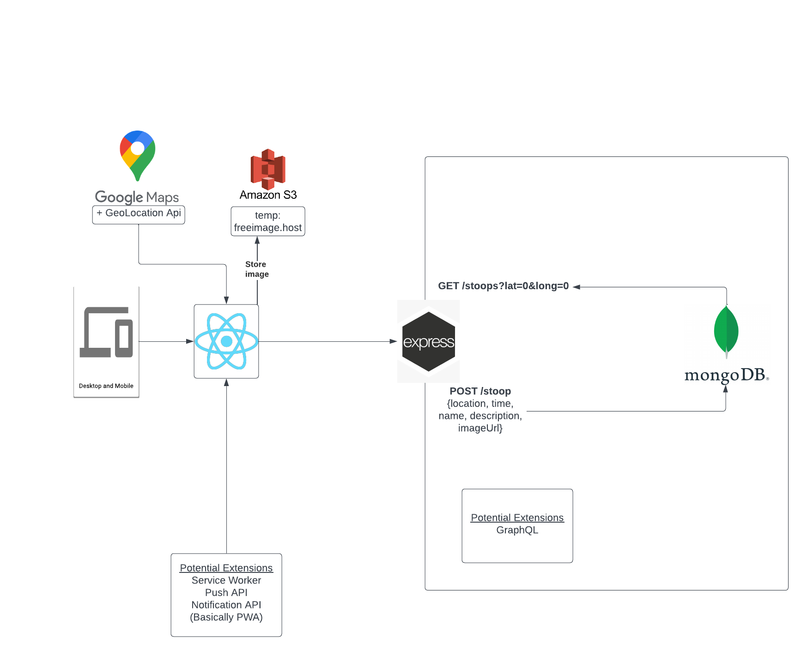

# Prototype
[Link to Prototype](https://www.figma.com/file/TzBnPo9hP4jpvrlr4lr1GE/StoopIt?node-id=0%3A1&t=1Oypt5zmROygY966-1)

# App Map
<!-- App Map Image -->

# Wireframes
<!-- Wireframe Description -->
## StoopIt Feed View
The Stoopit web app starts with a **feed view of the listed stoops**. The user can click on a stoop to view the stoop details. The user can also click on the "Add" button to post a new stoop in the **StoopIt Upload Form**. The user can also click on the "Map" button to view the stoops in **StoopIt Map View**.

## StoopIt Map View
The Stoopit web app also has a **map view of the listed stoops**. The user can click on a stoop to view the stoop details. The user can also click on the "Add" button to post a new stoop in the **StoopIt Upload Form**. The user can also click on the "Home" button to view the stoops in **StoopIt Feed View**.

## StoopIt Upload Form
The Stoopit web app also has a **form to upload a new stoop**. It allows the user to enter the name, description and select the location in **StoopIt Map Select**, and upload an image in the **StoopIt Camera View**.

Completed form after user enters everything, showing an upload button:

## StoopIt Map Select
The Stoopit web app has a **map view to select the location of a new stoop**. The user can click on the map to select the location of the stoop. A go-back button is provided to go back to the upload form.

## StoopIt Camera View
The Stoopit web app has a **camera view to upload an image of a new stoop**. The user can click on the camera button to take a picture of the stoop. A cancel button and a done button are also provided to cancel the selection or confirm the selection.

## StoopIt Upload Success View
The Stoopit web app has a **success view to confirm the upload of a new stoop**.

