# Prototype

[Link to Prototype](https://www.figma.com/file/TzBnPo9hP4jpvrlr4lr1GE/StoopIt?node-id=26%3A375&t=7CPBMIrICX19Gqay-1)

# App Map and High-level Architecture

<!-- App Map Image -->

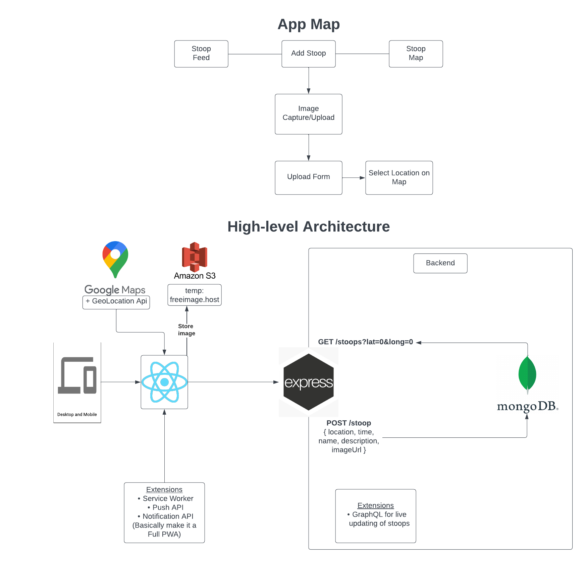

# Wireframes

<!-- Wireframe Description -->

## StoopIt Feed

The StoopIt web app starts with a **feed view of the listed stoops**. The user can click on "View on map" to view to view the stoop on a live map. The user can also click on the "Add" button to post a new stoop in the **StoopIt Upload Form**. The user can also click on the "Map" button to view the stoops in the **StoopIt Map**.

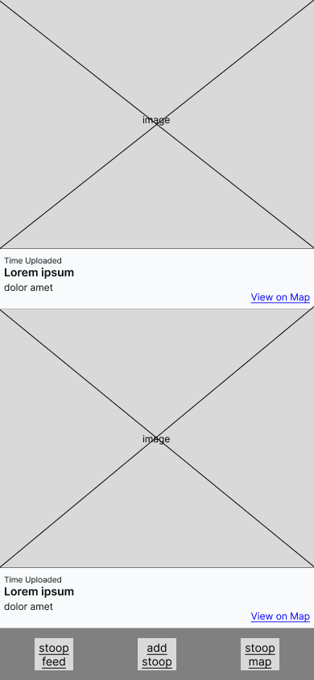

## StoopIt Map - Stoop Info and Focused Stoop Info

The StoopIt web app also has a **map view of stoops**. The user can click on a stoop to view the stoop details.
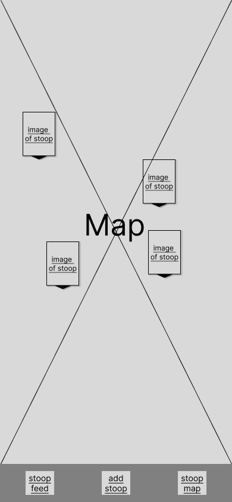
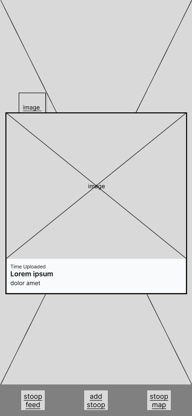

If a user navigates to the map through the feed's "View on Map" button, they will see a focused stoop with an outline on the map.
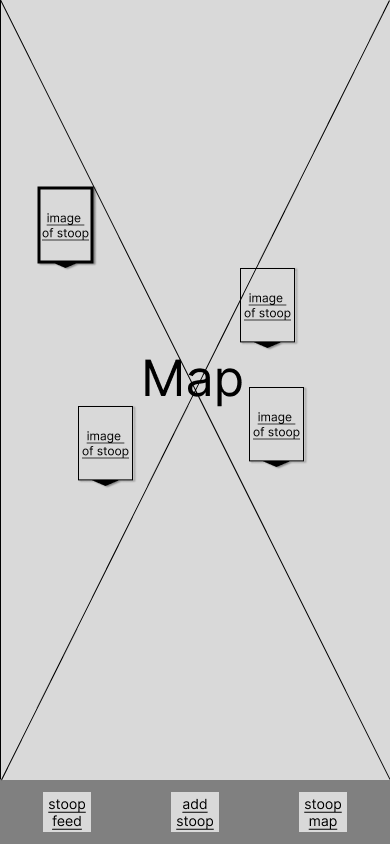
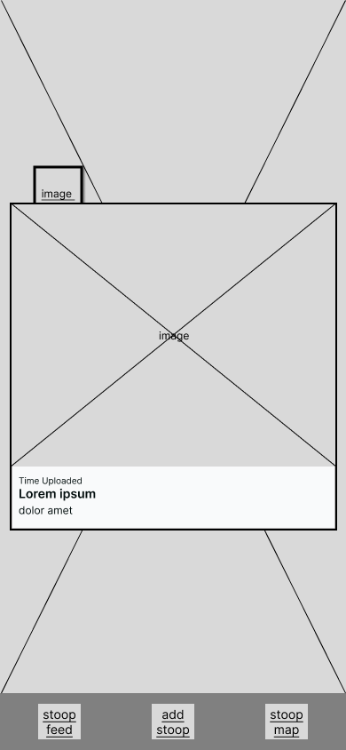

The user can also click on the "Add" button to post a new stoop through the **StoopIt Upload Form**. The user can also click on the "Stoop Feed" button to view the stoops in **StoopIt Feed**.

## StoopIt Camera, Camera Roll, and Confirmation

The StoopIt web app has a **camera view to upload an image of a new stoop**. The user can click on the camera button to take a picture of the stoop or click on the camera roll to upload a previously taken picture. A cancel button and a done button are also provided to cancel the selection or confirm the selection.

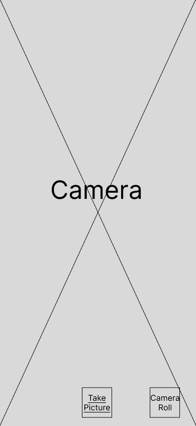
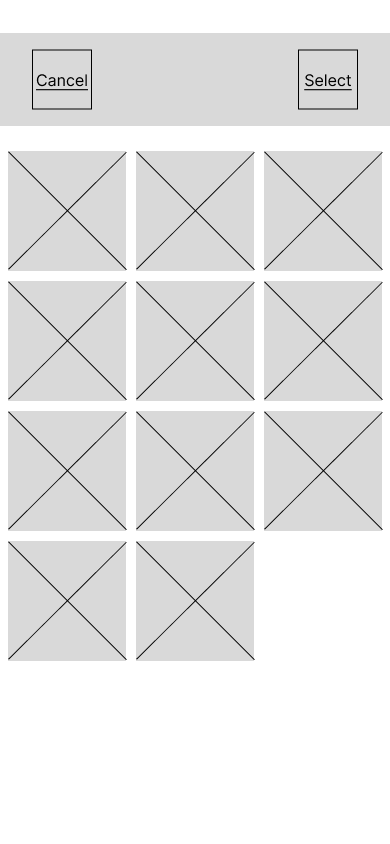

Once an image has been uploaded or taken, the user can choose to take another photo or continue with their selection to the **StoopIt Upload Form**

## StoopIt Upload Form

The StoopIt web app also has a **form to upload a new stoop**. It allows the user to upload an image via the **StoopIt Camera**, enter a title for the stoop, enter a description, and select the location either by clicking "Use Current Location" or in the **StoopIt Map Location Select**.

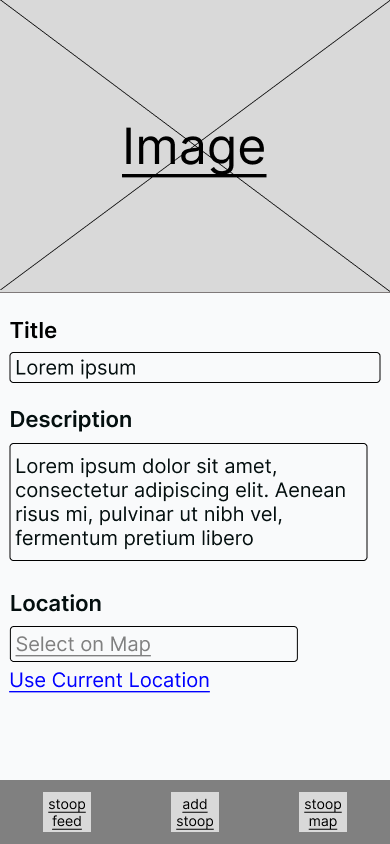

## StoopIt Upload Form - Map Location Select and Marker Placed

The StoopIt web app has a **map view to select the location of a new stoop**. The user can click on the map to select the location of the stoop. A go-back button is provided to go back to the upload form.

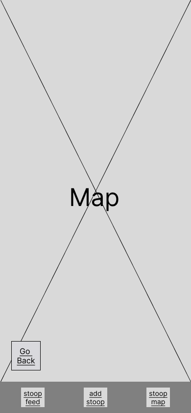
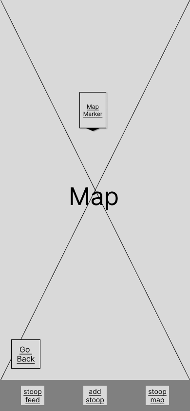

## StoopIt Upload Form - Error and Completion

If there are any errors such as an invalid or missing title, a missing image, or a failed upload an error will appear in the **StoopIt Upload Form**.
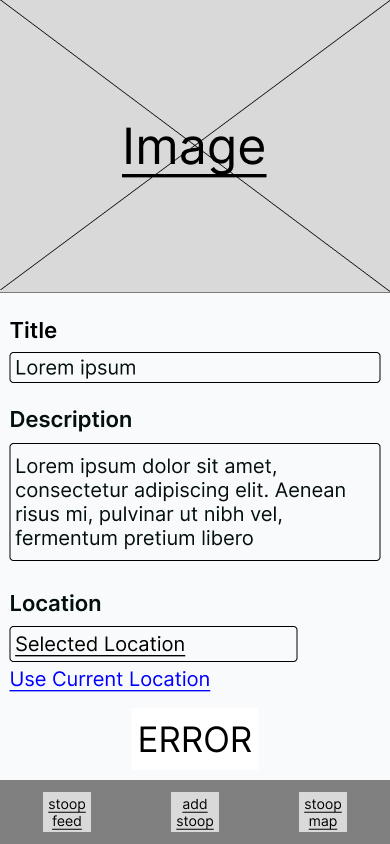

Once the user enters all fields correctly in the form, an upload button is shown. 
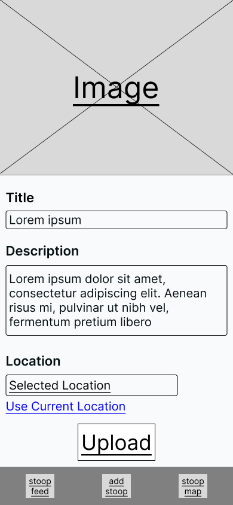

## StoopIt Upload Form - Uploading and Success

Once a user has clicked "Upload", the form will begin uploading the stoop and no form items are clickable. 
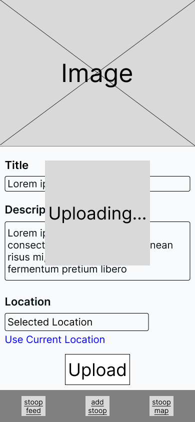

If the stoop fails to upload, the **StoopIt Upload Form Error view is shown**. Otherwise, StoopIt will show a **success view to confirm the upload of a new stoop** and redirect users to the **StoopIt Feed**.
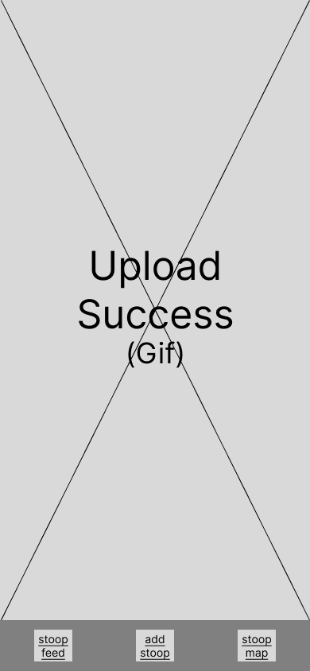
